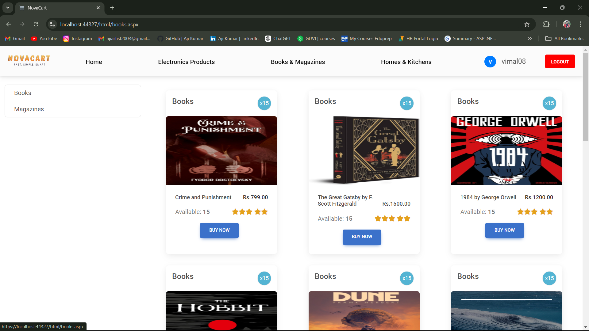
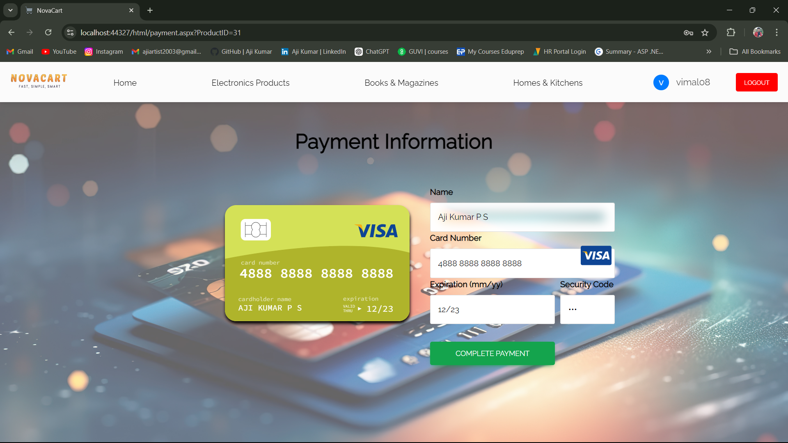
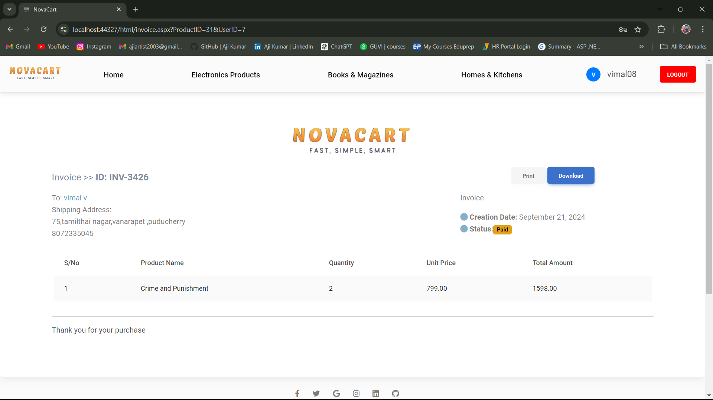

# NovaCart - Online Shopping Website

#### NovaCart is a modern online shopping platform built using ASP.NET with a 3-tier architecture. It allows users to explore a variety of products, add items to their cart

## Technologies Used
- Frontend: ASP.NET WebForms, HTML, CSS (MDB UI Kit, FontAwesome), JavaScript
- Backend: C#, ASP.NET WebForms
- Database: Microsoft SQL Server 2022
- IDE: Visual Studio 2022

## Screenshots
### Home Page 

### Products Page 

### Add to Cart Page 

### Payment Page 

### Invoice Page 

### Admin Page 

